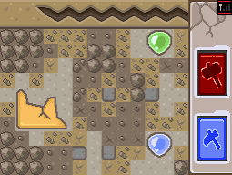
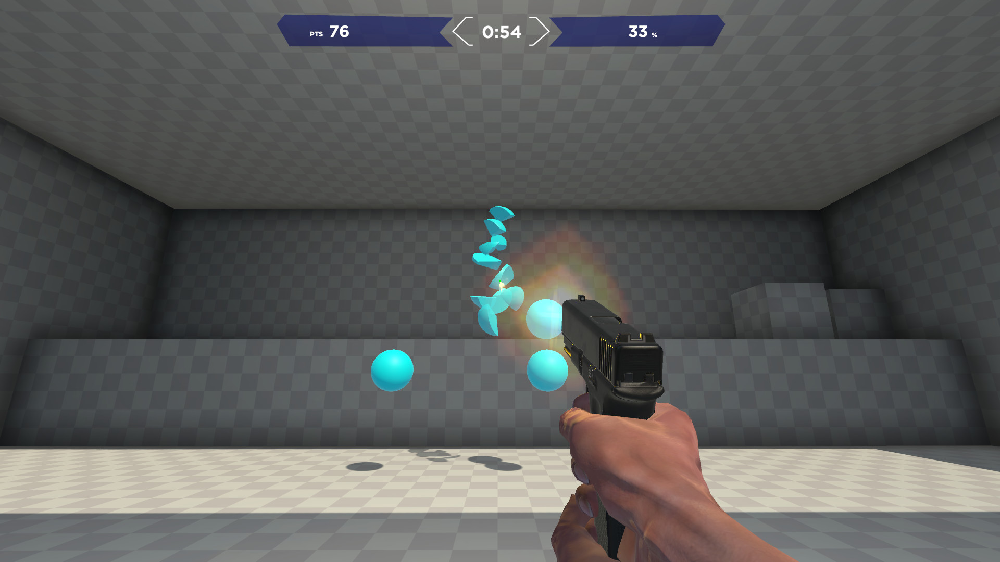
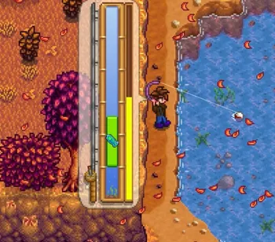
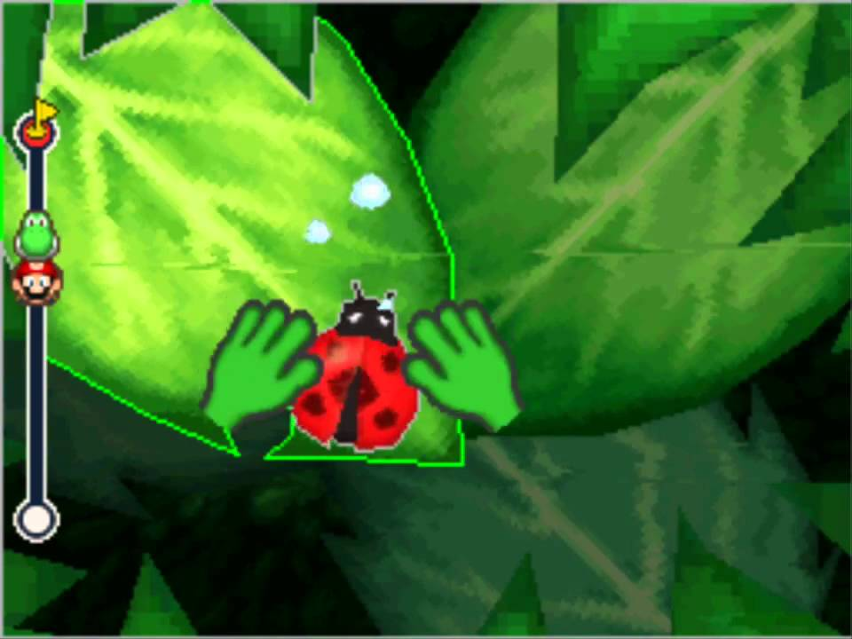
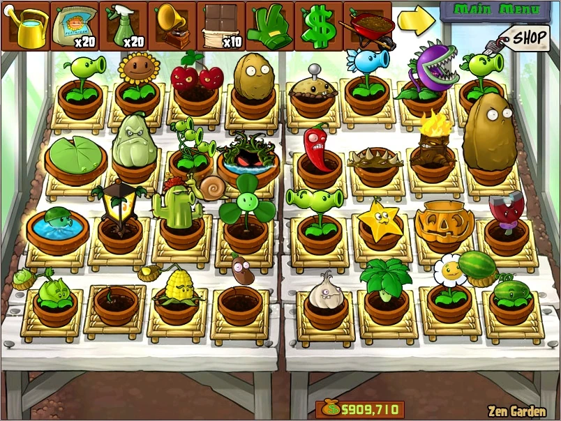
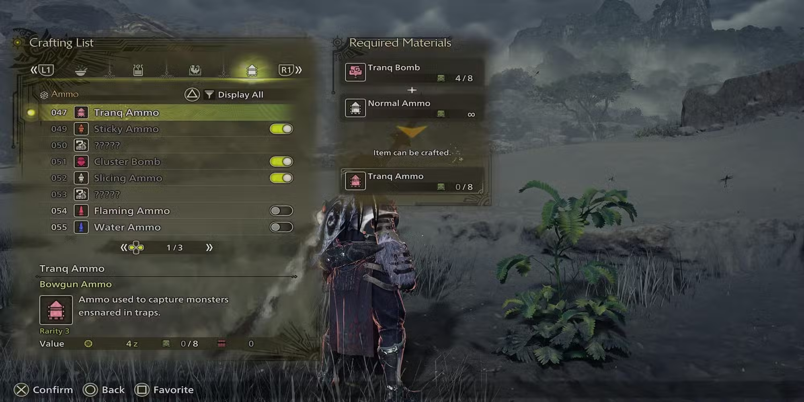
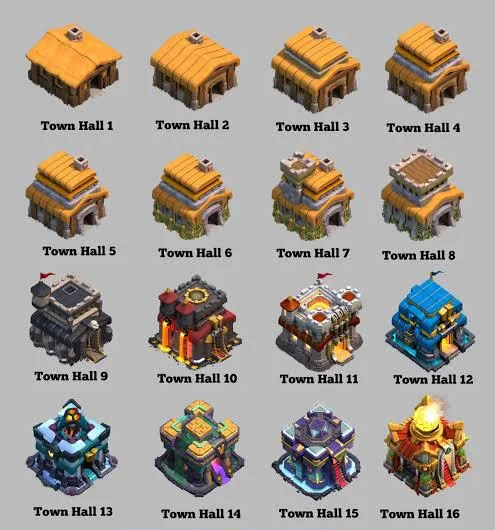
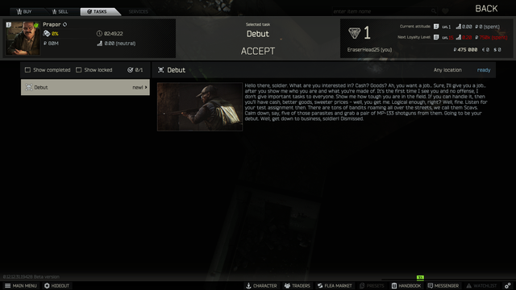
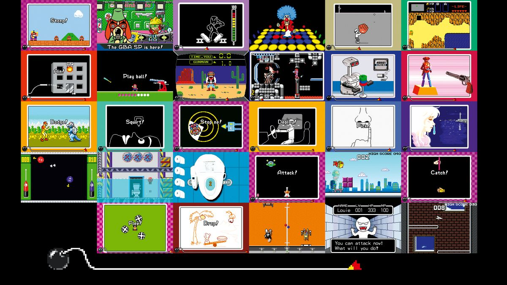
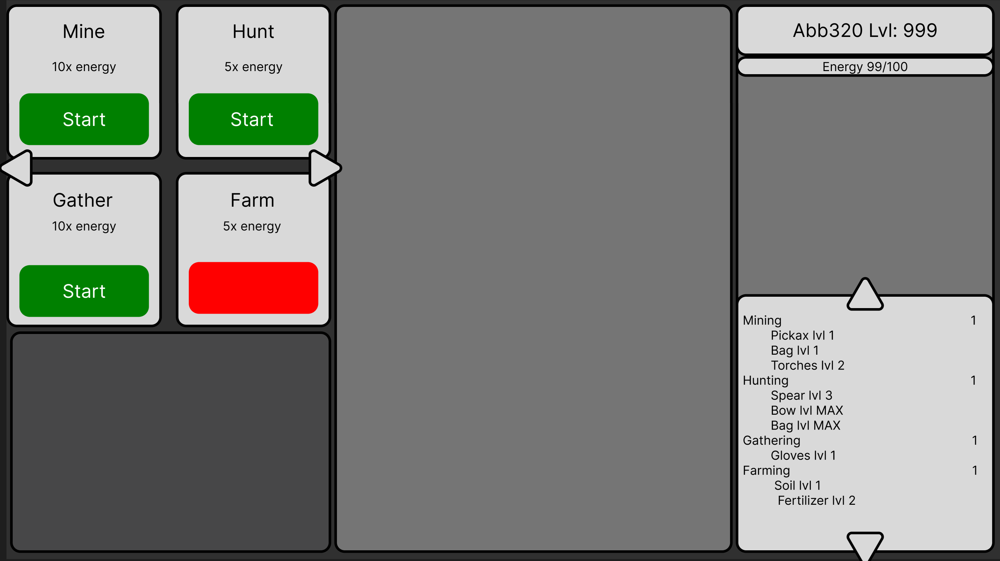

# **Loop**

Gather -> Craft -> Upgrade 

Gathering and Crafting will NEED to be gated by an **energy** system. This is because allowing players to run these indefinitely would make the market worthless.

Other aspects of gameplay include:
Trading
Questing 

# **Engagement system**

weekly reset: First 3 runs of an activity will give increased rewards compared to base. You can keep running activities for the base amount of rewards. Each activity(might want to separate it by system) has its own bonus reward count. These will reset every week and not roll over.

suggestions:
idk this is a system that will be needed as said above but how to balance it idk

# **MMO System**
This is a separate system from the main gather upgrades. This would wouldn't materials and gain exp from running activities.  

Classes ()
Perks ()
Use energy to train character
Raids (text based)

weekly/daily systems

Suggestions:
Races 
gear

# **Activities**

Activities is where players will get materials. These materials will be used in crafting and upgrading. Gathering activities will give materials more related to gathering but also some materials more used for Raiding. These can be run at anytime with no queueing and shorter times and less need to "engage" with it. Raids will give materials more related to raiding but also some for gathering. These will be multiplayer and need to be queue'd. Both Activities can drop random items that are used for progression in activities.

**Gathering Single Player Experience**
Gathering is the main actions a player will do. Players will run these activities at the cost of **energy** (and maybe other materials) and earn rewards at the end. Rewards will be random and based on the tier/level of the players activity (more below). These materials will be used to upgrade the players activity tiers or traded for other materials.

A list of activities are (we can always add more) and related materials:

For Gear
Mining    -> stone, ore, coal

Hunting   -> meat, hide, tallow

Items

Fishing WTF -> 

Gathering -> berries, mushrooms

Using other materials gathered or crafted materials can be used as **modifiers** for better rewards or shorter time.

Bag to gather more from mining
Berries as bait to lower time in hunting
Fertilizer to lower time in farming 

suggestions:
more activities
multi persons activities

**Raiding Multiplayer Experience**

Raids and similar activities would be geared towards a multiplayer experience. You can enter a queue to do these activities. These
raids would have level caps to run them. Once a level is hit you gain access to all dungeons and later on all raids.

All dungeons ->  locked dungeon -> all raids -> locked raid

2 dungeons
1 locked dungeon
2 raids
1 locked raid

**idle**

Farming   -> herbs, produce

# **Crafting**

Players  can refine and make new items for higher tier upgrades and items.

suggestions:
Potion crafting: similar to **modifiers** in gathering but would be more general and stronger
Gear crafting: Could be used for more things to use materials on and more **modifiers**

# **Upgrade**

Upgrades is where all the work will pay off. These will be a wide variety of improvements to the player. A core upgrade will be a way to increase the tier of an activity to get higher tier items. This is similar to Clash of Clans with Town Hall upgrades but with more/varied benefits.

Upgrades for Single Player Experience:
Tier upgrade
Speed upgrade
Energy upgrade
Reward upgrade

# **Trade**

Trading will allow players to divest from materials for either more gold or materials. Allowing for higher level players to give higher tier materials to lower level players for easy gold or lower tier materials they don't want to grind for. Lower level players have a chance to get higher tier materials that they have a hard time getting with gold or lower tier material they have extra of. Similar to Tarkov as a vision.

# **Questing**

This would also be a system similar to how Tarkov handles it. Having quests that want to to complete activities or return items in return for gold and other items.

suggestions:
this could be good for items needed to progress in upgrades so you need to progress this as part of the core loop

# **Suggested Systems**

**Modifiers**
This would be more of a mechanic of the game like buffs and what not. like using a potion would give you a timed modifier. This isn't a unique idea obviously but having a name tied to it would be fun like Destiny 2 and elemental verbs

**skill checks**
quick time events

**real shop**

**Moc**

TODO:
Redo moc (include main screen and 1 example of activity)
SRS (almost everyone)
