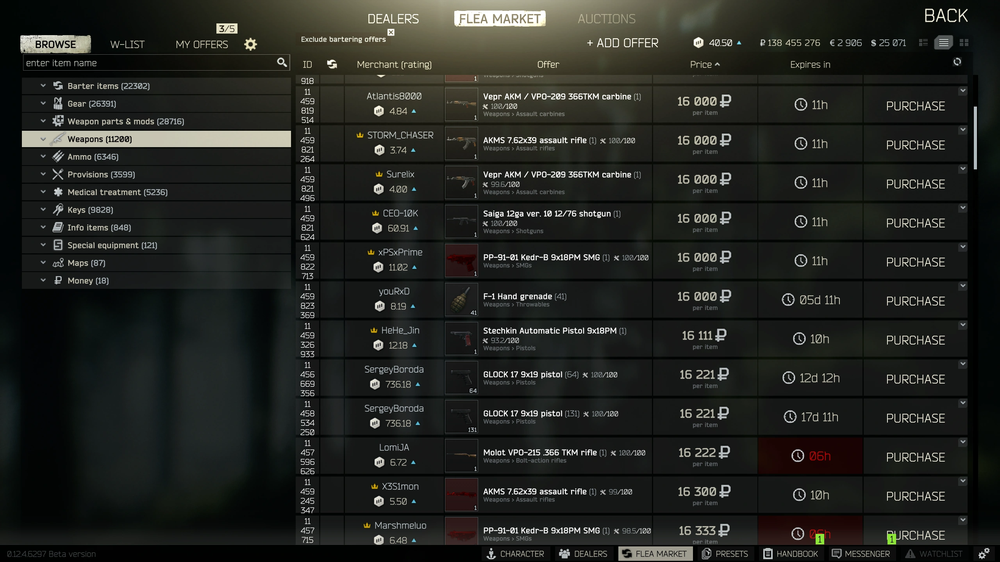

**Loop**

Gather -> Craft -> Upgrade 

Gathering and Crafting will NEED to be gated by an **energy** system. This is because allowing players to run these indefinitely would make the market worthless.

Other aspects of gameplay include:
Trading
Questing 

**Energy**

This is the currency used to interact with the game. This is to keep player retention and not allow a player to run away with infinite materials at no cost. This will replenish with time like a mobile game but a couple core differences. There will not be ways to buy energy. However there will be ways to get more energy that isn't waiting.

suggestions:
idk this is a system that will be needed as said above but how to balance it idk

**Gather**

Gathering is the main actions a player will do. Players will run these activities at the cost of **energy** (and maybe other materials) and earn rewards at the end. Rewards will be random and based on the tier/level of the players activity (more below). These materials will be used to upgrade the players activity tiers or traded for other materials.

A list of activities are (we can always add more) and related materials:

Mining    -> stone, ore, coal
Hunting   -> meat, hide, tallow
Farming   -> herbs, produce
Gathering -> berries, mushrooms

Using other materials gathered or crafted materials can be used as **modifiers** for better rewards or shorter time.

Bag to gather more from mining
Berries as bait to lower time in hunting
Fertilizer to lower time in farming 

suggestions:
more activities
multi persons activities

**Crafting**

Similar to Gathering the player will need to use **energy** to refine and make new items for higher tier upgrades and items.

suggestions:
Potion crafting: similar to **modifiers** in gathering but would be more general and stronger
Gear crafting: Could be used for more things to use materials on and more **modifiers**

**Upgrade**

Upgrades is where all the work will pay off. These will be a wide variety of improvements to the player. A core upgrade will be a way to increase the tier of an activity to get higher tier items. This is similar to Clash of Clans with Town Hall upgrades but with more/varied benefits.

Upgrades can include:
Tier upgrade
Speed upgrade
Energy upgrade
Reward upgrade

**Trade**

Trading will allow players to divest from materials for either more gold or materials. Allowing for higher level players to give higher tier materials to lower level players for easy gold or lower tier materials they don't want to grind for. Lower level players have a chance to get higher tier materials that they have a hard time getting with gold or lower tier material they have extra of. Similar to Tarkov as a vision.

**Questing**

This would also be a system similar to how Tarkov handles it. Having quests that want to to complete activities or return items in return for gold and other items.

suggestions:
this could be good for items needed to progress in upgrades so you need to progress this as part of the core loop

**Suggested Systems**

**Modifiers**
This would be more of a mechanic of the game like buffs and what not. like using a potion would give you a timed modifier. This isn't a unique idea obviously but having a name tied to it would be fun like Destiny 2 and elemental verbs

**RNG System**
footnote here for future but some form of rng system would be nice for further player retention. This could include a system of items and gear with random roles like Borderlands or Minecraft enchantments. These kind of items would provide buffs as long as they are equipped unlike the materials that can be used as **modifiers** in **Gather**